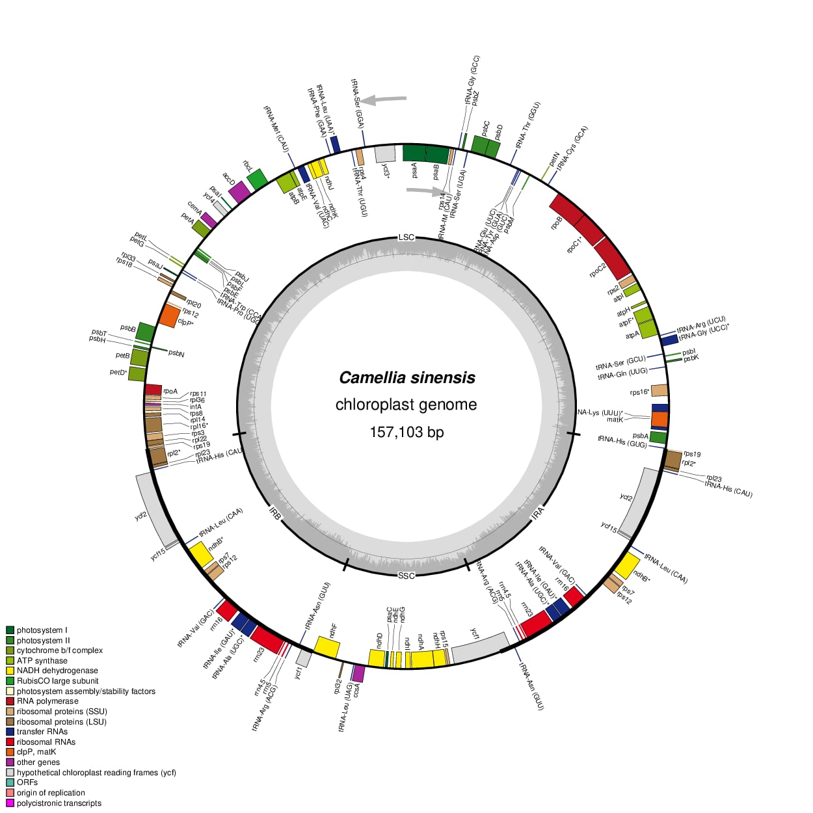

# Visualize Plastid Genome Structure

**Lab Activity:** Visualize Plastid Genome Structure  
**Name:** Shahanta Dawn B. Balanza  
**Course:** Cell and Molecular Biology  
**Section:** B  
**Date:** October 2, 2026  

**Scientific name:** *Camellia sinensis*  
**NCBI Accession:** NC_020019.1  
**Plastid genome length:** 157,103 bp  

## Genome Source

The annotated plastid genome file was obtained from the **NCBI Nucleotide database** using accession **NC_020019.1**.

The original annotated GenBank file is stored in:

[Annotated GenBank File](data/Camellia_sinensis_NC_020019.1.gb)

## Software Used

**OrganellarGenomeDRAW (OGDRAW)**

OGDRAW was used to generate a graphical map of the *Camellia sinensis* chloroplast genome.

## OGDRAW Settings

The annotated GenBank file was uploaded to OGDRAW using the following settings:

- **Map type:** Standard
- **Genome type:** Plastid
- **Map format:** Circular
- **Inverted repeats:** Automatic detection
- **GC content:** Displayed
- **Transcription direction:** Displayed
- **Legend:** Full legend displayed
- **Intron-containing genes:** Labeled with an asterisk (*)
- **Output format:** PNG
- **Resolution:** Fine

## Plastid Genome Map

## Structural Features Observed

The *Camellia sinensis* chloroplast genome has a typical quadripartite organization consisting of a large single-copy (LSC) region, a small single-copy (SSC) region, and two inverted repeat regions (IRa and IRb). The map shows protein-coding genes, tRNA genes, and rRNA genes distributed around the circular genome. Genes located within the inverted repeat regions are duplicated. The arrows indicate the direction of transcription, while the GC-content graph shows variation in GC content around the genome.

## Workflow

The annotated GenBank file was obtained from NCBI and uploaded to OGDRAW. A circular plastid genome map was generated using automatic inverted-repeat detection, GC content, transcription direction, and a full legend. The resulting PNG map was saved in the `figures` folder, while the original GenBank file was retained in the `data` folder. The biological observations and answers to the laboratory questions were saved in the `answers` folder.

## Answers

The answers to the laboratory questions are available here:

[Lab Plastid Genome Answers](answers/Lab_plastid_genome_answers.md)

